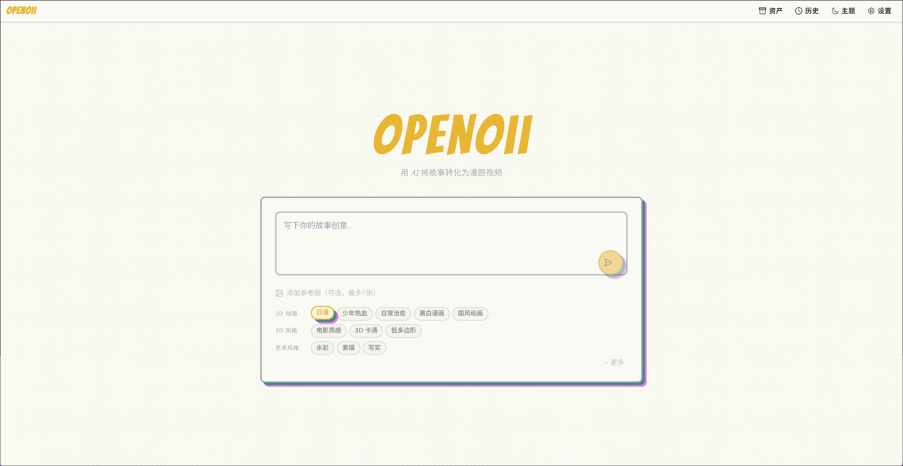
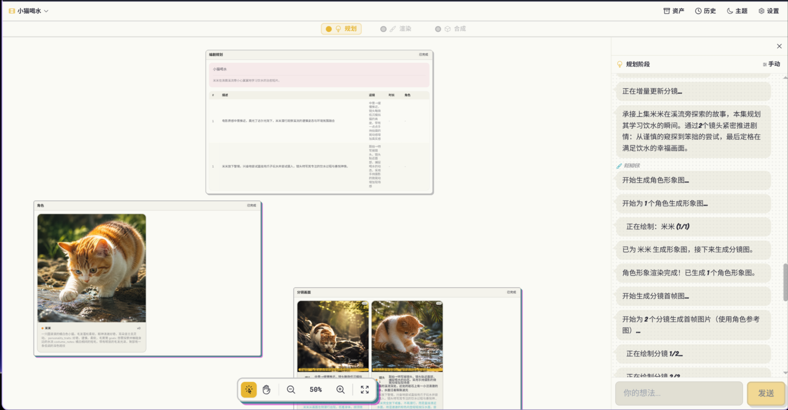
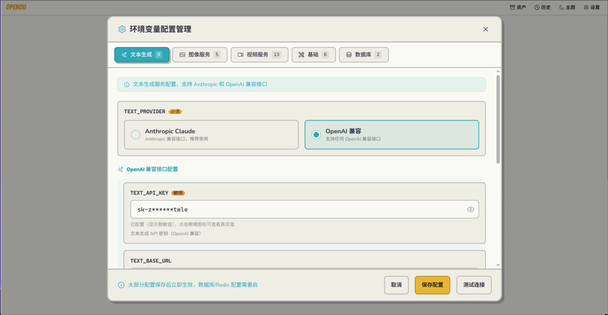

# PanelForge

<div align="center">
  

  <p><strong>Story Idea → Multi-Agent Collaboration → Comic Output</strong></p>
  <p>An AI-powered comic generation platform built with LangGraph multi-agent orchestration.</p>

  <p>
    
    
    
    
  </p>

  <p>
    <a href="#quick-start">Quick Start</a> ·
    <a href="#preview">Preview</a> ·
    <a href="#tech-stack">Tech Stack</a>
  </p>
</div>

PanelForge transforms story ideas into a complete pipeline of **planning, character/storyboard generation, video synthesis**, and displays the entire process on an infinite canvas.

> [!WARNING]
> This is a learning project focused on multi-stage orchestration, resumable execution, real-time progress, and full-stack collaboration.

## Features

- Multi-stage AI generation pipeline
- WebSocket real-time progress updates
- Resumable / cancellable / feedback-aware run flows
- tldraw infinite canvas for reviewing characters, storyboards, and outputs
- Frontend environment variable configuration panel

## Preview

<table>
  <tr>
    <td align="center" width="50%">
      
      <br />
      <sub><strong>Home · Story Input & Style Selection</strong></sub>
    </td>
    <td align="center" width="50%">
      
      <br />
      <sub><strong>Canvas · Characters, Storyboards & Generation Flow</strong></sub>
    </td>
  </tr>
  <tr>
    <td align="center" colspan="2">
      
      <br />
      <sub><strong>Config Panel · Manage Models & Services Online</strong></sub>
    </td>
  </tr>
</table>

## Tech Stack

- **Frontend**: React 18 + TypeScript + tldraw
- **Backend**: FastAPI + SQLModel + LangGraph
- **Infra**: PostgreSQL + Redis + `/static`

## Quick Start

```bash
cp backend/.env.example backend/.env
docker-compose up -d
```

- Frontend: http://localhost:15173
- API Docs: http://localhost:18765/docs

Local development:

```bash
# backend
cd backend
uv sync
uv run uvicorn app.main:app --reload --host 0.0.0.0 --port 18765

# frontend
cd frontend
pnpm install
pnpm dev
```

## Common Commands

```bash
# backend
cd backend
uv run pytest
uv run ruff check app tests

# frontend
cd frontend
pnpm test
pnpm build
```

## License

MIT
